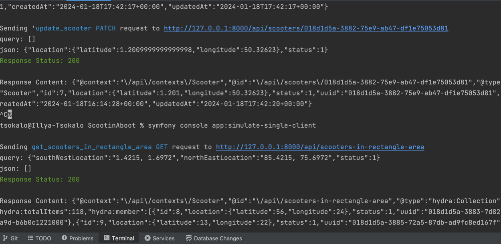

# Scootin' Aboot API Service
Scootin' Aboot is a MVP service for managing electric scooter rentals in Ottawa and Montreal. This RESTful API allows for querying scooters, and managing scooter locations, as well as making the rides and simulating fake clients.

Project **definitely** needs some of future optimizations, described in `assumptions.md` file.

Built with Symfony 6.3 and API Platform 3.2

## Prerequisites
Binaries installed for :
* Docker
* Composer
* PHP
* Symfony

## Installation

Clone this repository to your environment and follow these steps

```bash
composer install 
docker compose up -d
symfony server:start --port=8000

symfony console doctrine:database:create --no-interaction
symfony console doctrine:migrations:migrate --no-interaction
symfony console doctrine:fixtures:load --no-interaction

If you would like to run tests, use --env=test flag with the last 3 commands above.
```

## Usage
As project is built on top of <a href="https://api-platform.com/docs/distribution/"> API Platform </a> , to start using the API, you should go to the `/api` page and use following access token: `B03CzoSPwnYNZHsbflrAdNzAJkoeKRFxeWz`.

On the right upper corner you can find a button "Authorize" where you can paste the token in API Platform form.

Below you will see self documented list of available endpoints. 

(Alternatively, you can use the `symfony console debug:router` command to see the list of available endpoints or take a look at openapi_export.json file , which is generated within the API Platform)


To test basic journey run: 
1) _GET_ `/api/scooters-in-rectangle-area` ,find scooters in rectangular area by specifying 2 pairs of coordinates, then take some scooter id ,for the further steps chosen scooter status should be = 1 , otherwise you will not pass validation , as scooter is busy.
2) _POST_ `/api/trips` , start a trip with modifying request body with the scooter id from the previous step and execute the request , then copy the id of the trip from the response, you will need it for the ending of the trip.
3) _PATCH_ `/api/scooters/{id}` , modify request parameter with scooter id. If you want to update only location , then left status as it is. In the response you will see updated scooter location.
4) _PATCH_ `/api/trips/{id}` , modify request parameter with trip id from the step 2. In the request body you should specify current location, it will be considered as the end location of the trip. In the response you will see updated trip status, end location and date with time.

## Commands
These commands are responsible for emulating user scooter journey and available to run from the terminal:

Finding scooters, travelling for 10-15 seconds whilst updating location every 3 seconds, and resting for 2-5 seconds before starting next trip.

```php
# to run singe client simulation command
symfony console app:simulate-single-client

# to run multiple clients simulation command, symfony process component is used to run multiple processes in parallel
symfony console app:simulate-multi-client
```
Example output:


## Testing
*Before running the tests, make sure you have created a test database and migrated it, as described in the installation section.*

To run tests, use following command:
```bash
bin/phpunit
```
